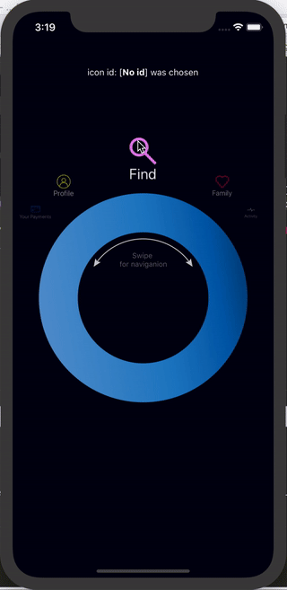
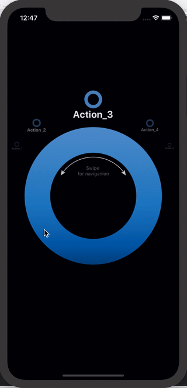
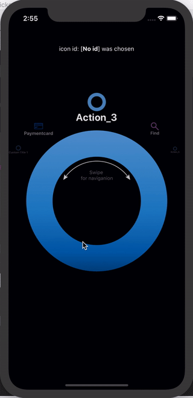
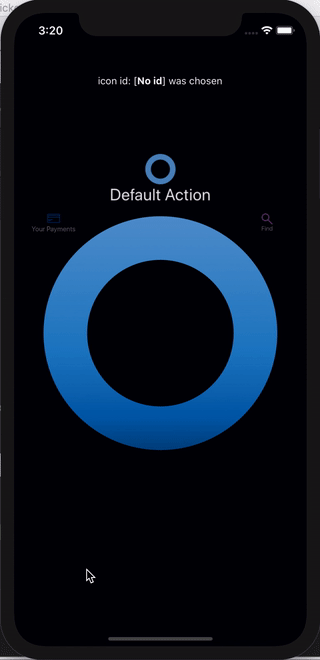

# react-native-ring-picker
This is the ring-shaped wheel navigator/selector component for react native with smooth native animations and infinite scroll.

## View


## Dependencies
This plugin depends on the SVG icons and main ring is an SVG icon as well, so necessary module should be installed along.

Inside the react native project do the following
- `npm i react-native-ring-picker --save` install the picker element
- `npm i react-native-svg --save` install the direct dependency of react native svg, since default icon is SVG and picker accepts the collection of SVG icons
- `cd ios` got to iOS project folder
    - `pod install` install native packages inside iOS project folder necessary for SVG work like  `RNSVG` from `../node_modules/react-native-svg`
    
## API

## Usage and configuration samples
These are the props that are supported by the picker.

| Name | Type | Default | Description |
| --- |:---:| :---:| --- |
| `girthAngle` | number | `120` | segment of icons spread above the ring, defines left and right visible borders to contain icons | 
| `onPress` | Function | `(iconId) => {}` | callback function that is called with clicked icon id or when ring center is clicked with id of the icon snapped to the vertical axis |
| `iconHideOnTheBackDuration` | ms | `250` | delay in ms necessary to complete the animation of icon hiding while it moves beneath the ring to its most left or right position to make infinite scroll |
| `icons` | React.Element, Object, string | `[{id: "action_1", title: "action_1"}, "action_2", "action_3", "action_4", "action_5"]` | collection of icons to be rendered, can be either react elements, string or objects that will render default icons |
| `showArrowHint` | boolean | `true` | shows two-sided arrow with hint how to interact with ring, disappears on first picker integration |
| `style` | Object | `{}` | styles of the main <View/> component usually used for picker positioning |
| `styleIconText` | Object | `{}` | styles extending default icon title's text styles defined inside the picker |
| `defaultIconColor` | rgb, rgba, hex string | `undefined` | styles for setting default icon's color |
| `isExpDistCorrection` | boolean | `true` | exponential distance correction, if disabled icons will be homogeneously distant one from another |
| `noExpDistCorrectionDegree` | number | `15` | half of angle, where vertical axis will be bisector and where no exponential distance correction is applied, helps visually stacking icons in the middle |

### Basic default UI

```jsx harmony
<ReactNativeRingPicker
    girthAngle={120}
    iconHideOnTheBackDuration={300}
    styleIconText={{fontWeight: 'bold'}}
/>
```

whereas in this example 5 default icons are used from the react-native-ring-picker plugin itself.



### Picker with custom icons with configurable ids and titles

```jsx harmony
<ReactNativeRingPicker
    icons={[{id: "custom_id_1", title: "custom title 1"}, <PaymentCard id={"payments"}/>, "action_3", <Search title={"find"} color={"#F88DFF"}/>, "action_5"]}
    girthAngle={120}
    iconHideOnTheBackDuration={300}
    onPress={(iconId) => someExternalIdSelection(iconId)}
    styleIconText={{fontWeight: "bold"}}
    style={{flex: 0, marginTop: 0}}/>
/>
```

where as in this example custom icons are sent into the picker. Picker accepts:
- either strings, which value would be converted into ids and title
- or objects with properties like id or title. If no id is passed - "default" will be used. If no title is passed id will be used.
- or react elements, basically any element can be used but I suggest SVG ones.



### Picker with 3 custom icons and 90 girth angle.

```jsx harmony
<ReactNativeRingPicker
    icons={[<PaymentCard id={"payments"} title={"Your payments"}/>, {"id": "default", "title": "Default action"}, <Search title={"find"} color={"#F88DFF"}/>]}
    girthAngle={90}
    onPress={(iconId) => someExternalIdSelection(iconId)}
    showArrowHint={false}
/>
```

whereas in this example 3 custom icons are used:
- <PaymentCard/> uses custom id and title
- {id, title} object uses custom id and title but default icon provided by the ring picker
- <Search/> uses custom title and the component name is used as an id by default (search) 



### Exponential distance correction is disabled

```jsx harmony
<ReactNativeRingPicker
    icons={[
        <PaymentCard id={"payments"} title={"Your payments"}/>,
        <Profile/>,
        <Search title={"find"} color={"#F88DFF"}/>,
        <Family/>,
        <Health title={"Activity"}/>
    ]}
    girthAngle={120}
    onPress={(iconId) => setChosenId(iconId)}
    style={{flex: 0, marginTop: 0}}
    defaultIconColor={"#ffccec"}
    isExpDistCorrection={false}
/>
```

where `isExpDistCorrection={false}` disables any exponential distance between icons making it homogeneous.


### Custom angle gap to disable exponential distance correction near the vertical axis

```jsx harmony
<ReactNativeRingPicker
    icons={[
        <PaymentCard id={"payments"} title={"Your payments"}/>,
        <Profile/>,
        <Search title={"find"} color={"#F88DFF"}/>,
        <Family/>,
        <Health title={"Activity"}/>
    ]}
    girthAngle={120}
    onPress={(iconId) => setChosenId(iconId)}
    style={{flex: 0, marginTop: 0}}
    defaultIconColor={"#ffccec"}
    noExpDistCorrectionDegree={5}
/>
```


where `noExpDistCorrectionDegree={5}` sets the range of 265°-275° where no exponential distance correction is applied,
this creates visual effect of icons stacking near the vertical axis.
